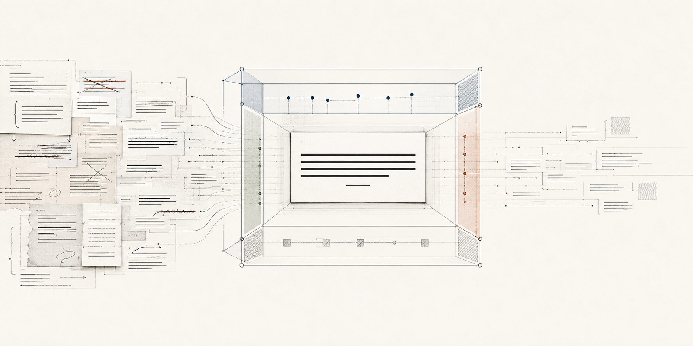
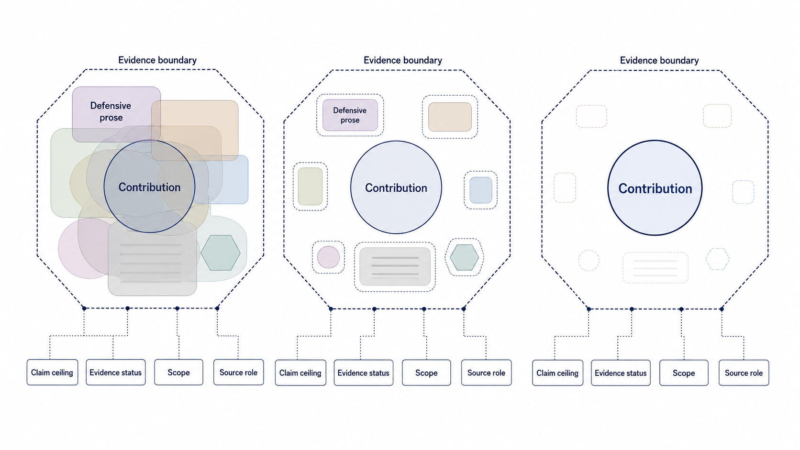
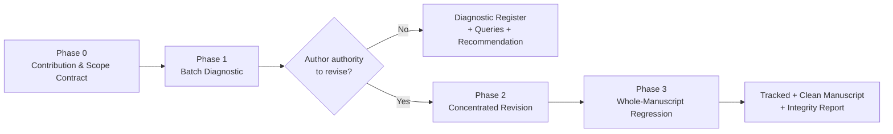
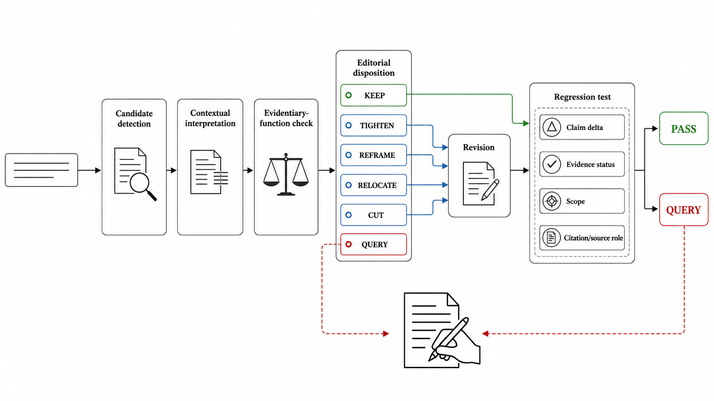

# Evidence-Bound Press-Conference Revision

[中文说明](README.zh-CN.md)

**Contribution-forward academic revision without overclaiming.**

Co-created on RedNote by [@Lensback's Lab](https://www.xiaohongshu.com/user/profile/64507c470000000012036d99) and [@Naruto AI](https://www.xiaohongshu.com/user/profile/666940c40000000007005b9a).

<p align="center">
  
</p>

`press-conference-revision-evidence-bound` is an academic revision skill for diagnosing and reducing **defensive writing** while preserving the evidentiary limits that make scholarly claims credible.

It is designed for manuscripts whose contribution is already present and supported, but is obscured by repeated caveats, self-defence, work-log narration, excessive qualification, unnecessary comparisons, or contribution statements buried beneath anticipatory responses to hypothetical reviewers.

The skill does **not** make a paper more assertive by inflating its claims. Instead, it helps a manuscript present its strongest supported contribution clearly while retaining the scope conditions, source-status distinctions, rival explanations, contradictions, methodological limits, and citation functions that determine what the evidence actually permits.

> **Core principle:** remove rhetorical defensiveness, not scholarly caution.

---

## Why “press-conference revision”?

Academic manuscripts often accumulate defensive prose during drafting, co-author revision, peer review, and repeated attempts to anticipate criticism.

The result can be a paper that reads less like an argument and more like a record of everything the authors worried about while producing it:

* the contribution appears only after several qualifications;
* limitations are repeated far beyond the point at which they constrain interpretation;
* paragraphs begin by explaining what the paper does *not* claim;
* methodological caution becomes self-deprecation;
* failed analytical routes remain visible as work-log narration;
* comparisons with stronger cases or literatures are volunteered even when they do not advance the argument;
* the paper answers objections that its own claims never created.

The **press-conference** metaphor asks a simple question:

> If the evidence is fixed, what should the paper say first about what it has actually established?

A good revision therefore does not conceal weaknesses or manufacture certainty. It reorganizes the manuscript so that the supported proposition leads, while the necessary qualification appears where it performs real analytical work.

The goal is:

**contribution → evidence → qualification**

rather than:

**qualification → self-defence → more qualification → eventual contribution**

---

## What this skill protects

The method is intentionally evidence-bound.

Every revision must preserve, or narrow, the original manuscript's epistemic commitments. In particular, the skill protects:

### Claim ceiling

A revision cannot increase the certainty, causality, novelty, generality, representativeness, or portability of a claim beyond what the existing evidence supports.

`may shape` cannot silently become `determines`.

`the interviews suggest` cannot become `the evidence demonstrates`.

`in this case` cannot become `cities generally`.

### Evidence status

The workflow keeps analytically different kinds of evidence separate, including:

* proposal;
* authorization;
* reported activity;
* direct observation;
* implementation;
* outcome;
* interpretation;
* causal inference.

Fluency is never a sufficient reason to collapse these distinctions.

### Scope conditions

Case, temporal, population, institutional, geographical, and comparative boundaries remain visible wherever they are needed to interpret a claim correctly.

### Rival explanations and negative evidence

Contradiction, delay, non-adoption, decoupling, reversal, failed implementation, and competing explanations are not treated as embarrassing residue when they are part of the empirical record.

### Citation and quotation roles

A stylistic revision must not silently change what a citation, quotation, date, number, source-specific term, table, figure, or footnote is being asked to support.

<p align="center">
  
</p>

---

## What the skill does

The skill supports two distinct modes.

### 1. Read-only diagnostic

The manuscript is audited without changing its prose.

The diagnostic produces:

* a **contribution-and-scope contract**;
* a manuscript-wide candidate register;
* explicit `KEEP` decisions for necessary caution;
* a section-level concentration map;
* an exception and query register;
* a bounded recommendation for any later revision.

This mode is useful when the author wants to understand whether defensive writing is actually a manuscript-level problem before authorizing changes.

### 2. Authorized revision

Once revision authority is explicit, the skill can perform a concentrated revision while preserving the evidence ceiling.

Typical outputs include:

* a tracked manuscript;
* a clean manuscript;
* a change summary organized by rhetorical pattern;
* a claim/evidence regression report;
* a record of deliberate non-edits;
* unresolved author decisions requiring human judgment.

The distinction is important: **diagnosis does not automatically authorize rewriting.**

---

## Workflow



### Phase 0 — Contribution-and-scope contract

Before editing begins, the skill establishes a compact contract containing:

| Field                      | Purpose                                                                              |
| -------------------------- | ------------------------------------------------------------------------------------ |
| **Core contribution**      | The strongest evidence-bound statement of the manuscript's primary analytical payoff |
| **Contribution hierarchy** | Primary concept, supporting lenses, empirical contribution, and portable payoff      |
| **Claim ceiling**          | The strongest formulation already permitted by the manuscript and its evidence       |
| **Load-bearing cautions**  | Qualifications that must survive revision                                            |
| **Edit authority**         | What may and may not be changed                                                      |
| **Live queries**           | Meaning-dependent decisions that must remain with the author                         |

If the contribution hierarchy, evidence ceiling, or editing authority cannot be established, the workflow stops at diagnosis rather than improvising a solution.

---

### Phase 1 — Batch diagnostic

The manuscript is first read as a whole.

The skill does **not** perform a blind search-and-replace operation. Lexical cues are treated only as signals for contextual inspection.

Candidates are classified using the following taxonomy:

| Code   | Pattern                                                    | Typical response                               |
| ------ | ---------------------------------------------------------- | ---------------------------------------------- |
| **D1** | Self-deprecation or apology                                | Cut or reframe                                 |
| **D2** | Anticipatory defence                                       | Cut, tighten, or relocate                      |
| **D3** | Stacked hedge                                              | Retain the epistemically necessary hedge       |
| **D4** | Work-log narration                                         | Reframe around problem, solution, and evidence |
| **D5** | Buried contribution                                        | Reframe or relocate                            |
| **D6** | Unnecessary comparison / volunteered loss                  | Narrow, reframe, or cut                        |
| **D7** | Broad negative self-judgment                               | Tighten to demonstrated scope                  |
| **D8** | Necessary caveat in the wrong rhetorical position          | Relocate                                       |
| **K1** | Scope condition                                            | Keep                                           |
| **K2** | Source-status distinction                                  | Keep                                           |
| **K3** | Rival, contradiction, delay, reversal, or non-adoption     | Keep                                           |
| **K4** | Ethical, provenance, reproducibility, or method limitation | Keep                                           |

The `K` categories are deliberately visible in the audit.

A high number of `KEEP` decisions is **not a failed revision**. It may indicate that the manuscript contains disciplined evidence-bound qualification rather than rhetorical defensiveness.

The unit of judgment is the **function of a statement in context**, not the presence of a particular word.

---

## The three-question test

Every candidate must pass three questions before it is changed:

1. **What function does this wording serve?**
   Is it rhetorical self-defence, evidence status, scope, method, rival explanation, an empirical result, or several of these simultaneously?

2. **What would disappear if it were removed?**
   The answer must identify the proposition or analytical boundary that would be lost—not simply describe a change in tone.

3. **Does the replacement preserve the ceiling?**
   The new wording must not increase certainty, causality, novelty, generality, representativeness, or portability.

If these questions cannot be answered confidently, the candidate becomes `QUERY`.

---

## Phase 2 — Concentrated revision

Authorized revisions are performed by **pattern group and section role**, rather than through global cue-word replacement.

Priority normally goes to:

1. abstract;
2. introduction;
3. discussion;
4. conclusion;
5. theoretical positioning;
6. methods;
7. empirical sections where defensive rhetoric materially obstructs interpretation.

A major section should normally contain a visible contribution sentence before qualification begins to dominate the paragraph.

Necessary caution remains, but is moved to the location where it does real analytical work.

For example:

**Defensive structure**

> Although this study cannot establish a universally applicable causal relationship and has several limitations arising from its case-specific design, the findings may nevertheless tentatively suggest that...

**Contribution-forward structure**

> The case shows that X operated through Y under these institutional conditions. This inference is limited to the documented case and does not establish a general causal relationship.

The second version is not stronger in evidentiary terms. It is simply clearer about **what is supported first** and **where the boundary lies**.

---

## Phase 3 — Whole-manuscript regression

Revision is followed by an independent regression pass.

This is not a proofreading step. Its purpose is to detect whether rhetorical improvement has accidentally altered the manuscript's epistemic structure.

<p align="center">
  
</p>

The regression checks:

* **claim delta** — no evidentiary inflation;
* **evidence status** — plan, report, observation, outcome, interpretation, and causation remain distinct;
* **citation role** — sources still support the propositions for which they were originally used;
* **scope** — relevant boundaries remain visible;
* **conceptual hierarchy** — supporting concepts do not accidentally become master concepts;
* **section role** — different sections perform complementary analytical work;
* **voice** — prose is direct without becoming promotional.

---

## Candidate dispositions

The audit uses six possible editorial dispositions:

| Disposition | Meaning                                                                                            |
| ----------- | -------------------------------------------------------------------------------------------------- |
| `KEEP`      | The wording performs necessary evidentiary or analytical work                                      |
| `TIGHTEN`   | The function is necessary but expressed redundantly                                                |
| `REFRAME`   | The proposition should remain but its rhetorical organization is defensive                         |
| `RELOCATE`  | Necessary information is currently placed where it obscures the contribution                       |
| `CUT`       | The rhetoric can disappear without removing a proposition, evidence boundary, or citation function |
| `QUERY`     | The decision depends on authorial meaning or evidentiary judgment                                  |

`CUT` therefore has a deliberately high threshold.

It can remove rhetoric. It cannot remove evidence.

---

## Automated cue scanner

The repository includes a lightweight DOCX cue scanner:

```text
scripts/scan_defensive_cues.py
```

It can create a preliminary candidate list from a clean `.docx` manuscript.

Example:

```bash
python scripts/scan_defensive_cues.py manuscript.docx \
  --out defensive-writing-candidates.csv
```

The script currently detects selected lexical patterns associated with:

* self-deprecation;
* anticipatory defence;
* hedge clusters;
* work-log narration;
* unnecessary comparison or concession.

It uses the Python standard library and reads paragraph text directly from the DOCX package.

### Important

**The scanner is not an automated editor and not a rhetorical classifier.**

A matched cue is only a candidate for human or agent inspection.

The scanner intentionally outputs:

```text
REVIEW_REQUIRED
```

rather than deciding whether a sentence should be kept, tightened, reframed, relocated, cut, or queried.

This distinction is central to the design of the skill:

> lexical detection may be automated; epistemic judgment should remain contextual.

---

## Audit register

The repository includes:

```text
assets/defensive-writing-audit-template.csv
```

The register records, among other fields:

* manuscript location;
* pattern code;
* candidate text;
* rhetorical function;
* evidentiary function;
* evidence status;
* relationship to the manuscript's contribution;
* provisional disposition;
* claim-delta check;
* citation/source-status check;
* whether an author decision is required;
* reviewer notes.

This makes the revision process inspectable rather than leaving integrity judgments implicit.

---

## Repository structure

```text
press-conference-revision-evidence-bound/
├── README.md
├── README.zh-CN.md
├── SKILL.md
├── agents/
│   └── openai.yaml
├── assets/
│   ├── defensive-writing-audit-template.csv
│   └── readme/
├── references/
│   ├── triage-and-regression.md
│   └── urban-geography-guardrails.md
└── scripts/
    └── scan_defensive_cues.py
```

### `SKILL.md`

Defines the core workflow, authority order, revision phases, preservation tests, deliverables, and stop rules.

### `references/triage-and-regression.md`

Contains the D1–D8 / K1–K4 candidate taxonomy, three-question test, caution-placement rules, and post-revision regression protocol.

### `scripts/scan_defensive_cues.py`

Provides lightweight lexical pre-screening of DOCX manuscripts. It generates candidate locations but deliberately makes no editorial decision.

### `assets/defensive-writing-audit-template.csv`

Provides a structured audit surface for candidate classification and integrity checking.

### `references/urban-geography-guardrails.md`

Demonstrates how the generic method can be supplemented with **project-specific guardrails**.

The bundled example protects a manuscript-specific conceptual hierarchy and evidence firewall. It is not required for generic use of the skill.

This illustrates a broader design principle:

```text
generic revision protocol
        +
project-specific evidence/concept guardrails
        =
bounded manuscript revision
```

Users working with manuscripts that have tightly defined concepts, source hierarchies, or previously agreed author decisions can create comparable project-specific guardrail files.

---

## Installation

Clone the repository into your Codex skills directory:

```bash
git clone https://github.com/lensback940701/Evidence-Bound-Press-Conference-Revision-Skill.git \
  ~/.codex/skills/press-conference-revision-evidence-bound
```

On Windows, the usual destination is:

```text
%USERPROFILE%\.codex\skills\press-conference-revision-evidence-bound
```

Restart or refresh Codex after installation. Invoke the skill as `$press-conference-revision-evidence-bound`.

---

## When to use this skill

This workflow is particularly useful when:

* a manuscript has already undergone several rounds of revision;
* peer-review responses have made the prose increasingly defensive;
* the contribution exists but is difficult to locate;
* the introduction spends too much space anticipating criticism;
* caveats recur across multiple sections;
* the manuscript repeatedly explains what it does not claim;
* qualitative or historical evidence requires careful source-status distinctions;
* competing explanations must remain visible;
* a co-author wants stronger prose but the evidentiary ceiling must not move;
* an AI-assisted revision needs an explicit integrity harness;
* tracked and auditable revision is preferable to unrestricted rewriting.

It is especially suited to qualitative, historical, interpretive, case-based, and mixed-method research where a small rhetorical change can materially alter what the evidence appears to establish.

---

## When *not* to use it

This skill is not designed for:

* first drafting;
* literature searches;
* new empirical research;
* citation discovery or citation repair;
* fact checking;
* evidence admission;
* generic grammar correction;
* copyediting alone;
* restructuring a paper without author authority;
* inventing stronger contribution claims;
* making results sound more causal, general, novel, or representative than they are.

If the underlying problem is weak evidence rather than defensive presentation, this skill should not be used to disguise that weakness.

---

## Example prompts

### Whole-manuscript diagnostic

```text
Use $press-conference-revision-evidence-bound to conduct a read-only,
whole-manuscript audit for defensive academic writing.

Do not revise the manuscript yet.

First establish the contribution-and-scope contract, then classify candidates
using the D1–D8 / K1–K4 taxonomy. Keep necessary scholarly caution visible as
KEEP decisions and identify all changes that would require author authority.
```

### Authorized revision

```text
Use $press-conference-revision-evidence-bound to revise the authorized sections
of this manuscript.

Make the supported contribution more visible and reduce rhetorical defensiveness,
but preserve the existing claim ceiling, evidence-status distinctions, scope
conditions, rival explanations, citations, quotations, and conceptual hierarchy.

Run the full regression protocol after revision and report deliberate non-edits
and unresolved author decisions.
```

### Diagnostic with cue scanner

```text
Use the bundled defensive-writing cue scanner only as a candidate-generation
step. Inspect every matched paragraph in context before assigning a disposition.

Do not treat lexical frequency as evidence of poor writing and do not perform
automatic global replacement.
```

---

## Design philosophy

### Contribution-forward, not promotional

The purpose is not to make academic writing sound confident for its own sake.

A sentence becomes stronger only when its **rhetorical position** becomes clearer—not when its evidentiary status is upgraded.

### Evidence-bound, not maximally cautious

More hedging is not automatically more rigorous.

Redundant caution can obscure exactly what the evidence *does* support.

The objective is to preserve the **minimum sufficient epistemic qualification**, not the maximum possible amount of defensive prose.

### Contextual, not lexical

Words such as `may`, `might`, `cannot`, `limitation`, or `however` are not intrinsically problematic.

The relevant question is what the wording is doing in that sentence, paragraph, section, and evidence chain.

### Auditable, not invisible

A revision system should record why something was changed—and why something conspicuously cautious was deliberately left unchanged.

For that reason, `KEEP` is a first-class audit outcome.

### Human-authority preserving

Meaning-dependent decisions remain with the author.

When a revision would alter the research question, conceptual hierarchy, evidence interpretation, citation role, substantive limitation, or other authorial commitment, the correct output is `QUERY`, not improvisation.

---

## A compact formulation

The skill can be summarized as:

```text
Diagnose rhetoric
        ↓
Identify evidentiary function
        ↓
Surface the supported contribution
        ↓
Preserve the claim ceiling
        ↓
Preserve evidence status and scope
        ↓
Regression-test the manuscript
```

Or, more simply:

> **Say clearly what the evidence supports. Keep exactly the caution needed to show what it does not.**

---

## Responsible use

This project supports experimental, human-controlled academic revision. It does not guarantee manuscript quality, factual accuracy, publishability, or compliance with journal or institutional policy.

Users remain responsible for:

* verifying facts, data, citations, quotations, interpretations, and substantive claims;
* reviewing and approving every AI-assisted revision;
* ensuring that no data, sources, procedures, or findings are fabricated or misrepresented;
* following current journal, institutional, funder, and professional rules for generative AI use and disclosure; and
* protecting unpublished research materials, interview data, personal information, and confidential documents.

The skill is designed to assist bounded, auditable revision—not to replace scholarly judgment, authorship, or accountability.

---

## Limitations

This skill cannot determine whether the underlying research is empirically correct.

It does not independently verify citations, reconstruct missing evidence, resolve contradictory source material, or establish whether a substantive claim is true.

Its integrity mechanisms depend on the manuscript, source-status information, author decisions, and other materials supplied to the revision environment.

The bundled cue scanner is deliberately conservative and incomplete. It should be treated as a retrieval aid, not as a measure of manuscript quality.

No raw cue count should be interpreted as an editing target or a before/after quality score.

---

## Contributing

Contributions are welcome, especially those that improve:

* defensive-writing candidate taxonomies;
* false-positive handling;
* multilingual cue detection;
* evidence-status classification;
* claim-delta regression;
* auditability;
* project-specific guardrail patterns;
* integration with tracked-change manuscript workflows.

New automated rules should follow one principle:

> **Automation may expand candidate discovery, but it must not silently replace contextual evidentiary judgment.**

Changes that encourage blind hedge removal, automatic claim strengthening, global terminology substitution, or evidence-blind rewriting are inconsistent with the purpose of this project.

---

## Acknowledgment

This project is built around a simple premise: academic revision should improve the visibility of a contribution without changing the epistemic contract between the manuscript and its evidence.

The strongest version of a paper is not necessarily the version with the strongest language.

It is the version in which readers can see, as directly as possible, **what the evidence establishes, why it matters, and where its limits actually begin**.
