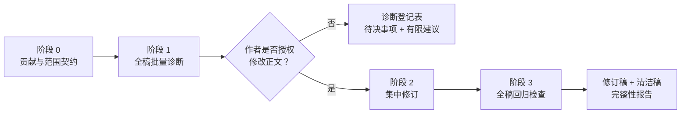

# 证据约束型“发布会式”论文修订

[English](README.md)

**让有证据支撑的贡献先被看见，同时坚决避免过度主张。**

本项目由小红书 [@Lensback's Lab](https://www.xiaohongshu.com/user/profile/64507c470000000012036d99) 与 [@鸣人学AI](https://www.xiaohongshu.com/user/profile/666940c40000000007005b9a) 共同创作。

<p align="center">
  
</p>

`press-conference-revision-evidence-bound` 是一个用于识别和减少学术论文中**防御性写作**的修订 Skill。它帮助作者把已经存在、且已经获得证据支持的贡献表达得更直接，同时保留决定学术主张边界的证据状态、适用范围、竞争性解释、矛盾材料、方法限制与引文功能。

它并不通过夸大结论让论文显得更强势。它要改变的是贡献与限定的**修辞位置**，而不是论文与证据之间的认识论契约。

> **核心原则：减少修辞性防御，不减少必要的学术审慎。**

---

## 为什么叫“发布会式修订”？

论文在起草、合作者修改、同行评议和反复预判批评的过程中，常会不断累积防御性表达。最终的文本可能不再像一篇清晰提出论点的论文，而更像作者所有担忧和修改过程的工作日志：

* 核心贡献要经过多层限定才出现；
* 同一局限在不同章节反复说明；
* 段落先花大量篇幅解释论文“不主张什么”；
* 方法上的审慎逐渐变成自我贬低；
* 已经放弃的分析路径仍以过程叙述留在正文；
* 不必要地拿个案与更强案例或更大文献比较；
* 回答了论文自身主张并未引出的假想质疑。

“发布会式”这个比喻只提出一个问题：

> 当证据保持不变时，论文应该先说清楚自己究竟建立了什么？

好的修订不会遮掩弱点，也不会制造确定性。它让得到支持的命题先出现，再把必要限定放到真正承担分析功能的位置。

目标是：

**贡献 → 证据 → 限定**

而不是：

**限定 → 自我辩护 → 更多限定 → 最后才出现贡献**

---

## 这个 Skill 保护什么？

所有修改都必须维持或缩窄原稿的认识论承诺。

### 主张上限

修改不能让主张在确定性、因果性、创新性、普遍性、代表性或可迁移性上超过现有证据允许的程度。

`可能影响` 不能悄悄变成 `决定`。

`访谈材料表明` 不能变成 `证据证明`。

`在本案例中` 不能变成 `城市通常都会`。

### 证据状态

工作流明确区分：

* 提议；
* 授权；
* 被报告的活动；
* 直接观察；
* 实施；
* 结果；
* 解释；
* 因果推断。

语言更加流畅，不能成为合并这些状态的理由。

### 适用范围

个案、时间、人群、制度、地理与比较边界必须在影响主张解释的位置保持可见。

### 竞争性解释与负面证据

如果矛盾、延误、未采纳、脱耦、逆转、实施失败或竞争性解释属于实证记录，它们就不是需要隐藏的“尴尬残余”。

### 引文与引用功能

风格修改不能悄悄改变一条引文、一段直接引语、日期、数字、来源专用术语、表格、图片或脚注原本被要求支持的命题。

---

## 两种工作模式

### 1. 只读诊断

只审计稿件，不修改正文。典型产出包括：

* **贡献与范围契约**；
* 全稿候选项登记表；
* 对必要审慎表达作出的显式 `KEEP` 判断；
* 分章节的防御性表达分布图；
* 例外与待作者判断事项；
* 后续修订的有限建议。

这一模式适合作者先判断：防御性写作是否真的构成全稿层面的问题。

### 2. 经授权的集中修订

只有在修改权限明确后，Skill 才能在不移动证据上限的前提下开展集中修订。典型产出包括：

* 带修订痕迹的稿件；
* 清洁稿；
* 按修辞模式组织的修改摘要；
* 主张—证据回归检查报告；
* 有意不修改的内容记录；
* 必须由作者处理的未决事项。

这一区分很重要：**完成诊断并不自动获得改写授权。**

---

## 工作流



### 阶段 0——建立贡献与范围契约

正式修改前，先建立一份紧凑的契约：

| 字段 | 作用 |
| --- | --- |
| **核心贡献** | 用一句受证据约束的话说明论文最主要的分析动作与学术收益 |
| **贡献层级** | 主概念、辅助视角、有限的实证贡献，以及可能存在的可迁移收益 |
| **主张上限** | 当前稿件与证据已经允许的最强表述 |
| **承重型限定** | 修改后仍必须保留的范围、证据状态、方法、竞争性解释、矛盾与伦理限定 |
| **修改权限** | 可修改与锁定的章节、追踪要求及禁止事项 |
| **未决问题** | 不能由代理擅自决定的意义依赖型问题 |

如果贡献层级、证据上限或修改权限无法明确，工作流应停在诊断阶段，而不是自行补造答案。

---

### 阶段 1——全稿批量诊断

首先把论文作为一个整体阅读。Skill 不进行盲目的关键词查找替换；词汇线索只用于定位需要结合上下文判断的位置。

候选项使用以下分类：

| 代码 | 模式 | 常见处理 |
| --- | --- | --- |
| **D1** | 自我贬低或道歉 | 删除或重构 |
| **D2** | 预防性辩护 | 删除、压缩或移动 |
| **D3** | 叠加式模糊限定 | 只保留认识论上必要的限定 |
| **D4** | 工作日志式叙述 | 围绕问题、解决方式和证据重构 |
| **D5** | 被掩埋的贡献 | 重构或前移 |
| **D6** | 不必要比较或主动示弱 | 缩窄、重构或删除 |
| **D7** | 超出证据范围的负面自我判断 | 缩窄到已经展示的范围 |
| **D8** | 放错修辞位置的必要限定 | 移动 |
| **K1** | 适用范围条件 | 保留 |
| **K2** | 来源或证据状态区分 | 保留 |
| **K3** | 竞争解释、矛盾、延误、逆转或未采纳 | 保留 |
| **K4** | 伦理、来源、可复现性或方法限制 | 保留 |

`K` 类别必须在审计中明确可见。

大量 `KEEP` 并不表示修订失败。它可能说明稿件原本就包含纪律严明、受证据约束的必要限定。

判断单位是**一句话在具体上下文中的功能**，不是某个单词是否出现。

---

## 修改前的三个问题

每个候选项在被修改前，都必须回答：

1. **这段表达承担什么功能？**
   它是修辞性自我防御、证据状态、适用范围、方法说明、竞争性解释、实证结果，还是同时承担多种功能？

2. **如果删掉它，什么会消失？**
   答案必须指出会丢失的命题或分析边界，而不能只说语气变得不同。

3. **替代表达是否保持主张上限？**
   新表述不能提高确定性、因果性、创新性、普遍性、代表性或可迁移性。

无法可靠回答时，正确处理是 `QUERY`。

---

### 阶段 2——集中修订

经授权的修订应按照**修辞模式与章节功能**成组处理，而不是全局删除某些词。

通常优先处理：

1. 摘要；
2. 引言；
3. 讨论；
4. 结论；
5. 理论定位；
6. 方法；
7. 防御性表达确实妨碍理解的实证章节。

每个主要章节应当先让贡献句可见，再出现必要限定。限定不能消失，但应被放在真正承担分析功能的位置。

例如：

**防御性结构**

> 尽管本研究由于个案设计存在若干局限，也无法建立具有普遍适用性的因果关系，但研究发现或许仍可初步提示……

**贡献前置结构**

> 本案例表明，在这些制度条件下，X 通过 Y 发挥作用。这一判断仅适用于现有记录所覆盖的案例，并不建立一般性的因果关系。

第二种表述在证据意义上没有变强，只是先说清楚**什么得到了支持**，再说明**边界从哪里开始**。

---

### 阶段 3——全稿回归检查

修订后必须独立进行全稿检查。这不是普通校对，而是为了发现修辞改善是否意外改变了论文的认识论结构。

重点检查：

* **主张变化**——没有证据膨胀；
* **证据状态**——计划、报告、观察、结果、解释与因果仍然可区分；
* **引文功能**——来源仍支持其原本承担的命题；
* **适用范围**——必要边界仍然可见；
* **概念层级**——辅助概念没有意外变成主概念；
* **章节功能**——不同章节继续承担互补的分析任务；
* **写作声音**——表达更直接，但没有变成宣传性语言。

---

## 六种处理结果

| 处理结果 | 含义 |
| --- | --- |
| `KEEP` | 原表述承担必要的证据或分析功能 |
| `TIGHTEN` | 功能必要，但表达重复 |
| `REFRAME` | 命题应保留，但当前修辞结构过度防御 |
| `RELOCATE` | 必要信息所在位置遮蔽了贡献 |
| `CUT` | 可以删除修辞，而不删除命题、证据边界或引文功能 |
| `QUERY` | 处理方式依赖作者意图或证据判断 |

因此，`CUT` 的门槛被有意设置得很高：

> 可以删除修辞，不能删除证据。

---

## 自动线索扫描器

仓库提供一个轻量级 DOCX 扫描器：

```text
scripts/scan_defensive_cues.py
```

它可以从清洁版 `.docx` 中生成初步候选列表：

```bash
python scripts/scan_defensive_cues.py manuscript.docx \
  --out defensive-writing-candidates.csv
```

扫描器可定位与自我贬低、预防性辩护、模糊限定叠加、工作日志叙述以及不必要比较相关的部分词汇模式。

**它不是自动编辑器，也不是修辞分类器。** 命中结果只表示需要结合上下文检查。脚本有意输出：

```text
REVIEW_REQUIRED
```

而不会自动决定 `KEEP`、`TIGHTEN`、`REFRAME`、`RELOCATE`、`CUT` 或 `QUERY`。

> 词汇检测可以自动化，认识论判断必须保留上下文。

---

## 审计登记表

仓库中的：

```text
assets/defensive-writing-audit-template.csv
```

用于记录候选项位置、模式代码、原文、修辞功能、证据功能、证据状态、与核心贡献的关系、初步处理、主张变化检查、引文或来源状态检查、是否需要作者决定以及审阅说明。

这使修改决策可以被检查，而不是让完整性判断停留在代理内部。

---

## 仓库结构

```text
press-conference-revision-evidence-bound/
├── README.md
├── README.zh-CN.md
├── SKILL.md
├── agents/
│   └── openai.yaml
├── assets/
│   ├── defensive-writing-audit-template.csv
│   └── readme/
├── references/
│   ├── triage-and-regression.md
│   └── urban-geography-guardrails.md
└── scripts/
    └── scan_defensive_cues.py
```

* `SKILL.md`：核心工作流、权限顺序、保留测试、产出与停止规则。
* `references/triage-and-regression.md`：D1–D8、K1–K4 分类、三个问题测试与回归协议。
* `scripts/scan_defensive_cues.py`：只生成候选位置，不作编辑判断。
* `assets/defensive-writing-audit-template.csv`：结构化候选项审计表。
* `references/urban-geography-guardrails.md`：展示如何为通用方法补充项目专用的概念与证据边界；它不是一般使用的必需文件。

核心设计可以概括为：

```text
通用修订协议
        +
项目专用证据与概念护栏
        =
有边界的论文修订
```

---

## 安装

将仓库克隆到 Codex 的 skills 目录：

```bash
git clone https://github.com/lensback940701/Evidence-Bound-Press-Conference-Revision-Skill.git \
  ~/.codex/skills/press-conference-revision-evidence-bound
```

Windows 的常用目录为：

```text
%USERPROFILE%\.codex\skills\press-conference-revision-evidence-bound
```

安装后重启或刷新 Codex。调用名称为 `$press-conference-revision-evidence-bound`。

---

## 适合何时使用？

特别适合以下情况：

* 稿件已经经历多轮修订；
* 回复审稿意见后，正文越来越像防御性答辩；
* 贡献确实存在，但读者很难找到；
* 引言用太多篇幅预判批评；
* 同一限定在多个章节反复出现；
* 论文不断解释自己“不主张什么”；
* 质性或历史材料要求严格区分来源状态；
* 竞争性解释必须继续可见；
* 合作者希望语言更有力，但证据上限不能移动；
* AI 辅助修改需要显式的完整性护栏；
* 与自由改写相比，更需要可追踪、可审计的修改。

它尤其适合质性、历史、解释性、案例型与混合方法研究，因为这些论文中的细小修辞变化也可能改变证据看起来能够建立什么。

---

## 不适合哪些任务？

本 Skill 不用于：

* 从零起草论文；
* 文献检索；
* 新的实证研究；
* 引文发现或引文修复；
* 事实核查；
* 接纳新证据；
* 一般性语法修改；
* 单纯复制编辑；
* 未经作者授权重构论文；
* 发明更强的贡献主张；
* 让结果显得比证据允许的更因果、更普遍、更新颖或更具代表性。

如果根本问题是证据不足，就不应使用本 Skill 掩饰这一缺陷。

---

## 调用示例

### 全稿只读诊断

```text
请使用 $press-conference-revision-evidence-bound，
对这篇完整稿件开展防御性学术写作的只读审计。

暂时不要修改正文。

先建立贡献与范围契约，再使用 D1–D8 / K1–K4 分类候选项。
请把必要的学术审慎明确标为 KEEP，并指出所有必须获得作者授权的修改。
```

### 经授权的修订

```text
请使用 $press-conference-revision-evidence-bound，
修改这篇稿件中已经获得授权的部分。

让得到支持的贡献更容易被看见，并减少修辞性防御，
但必须保留现有主张上限、证据状态、适用范围、竞争性解释、
引文、直接引语和概念层级。

修改后执行完整回归检查，并报告有意不修改的内容与未决作者事项。
```

### 配合自动扫描器

```text
只把仓库中的防御性写作线索扫描器用于生成候选项。
为每一个命中段落读取上下文后再决定处理方式。

不得把词汇频次视为写作质量证据，也不得执行全局自动替换。
```

---

## 设计理念

### 贡献前置，而非宣传性写作

目标不是让论文为了显得自信而使用更强语言。句子之所以“更强”，应当是因为它的修辞位置更清晰，而不是因为证据状态被升级。

### 证据约束，而非最大限度谨慎

限定词越多并不自动意味着越严谨。重复限定可能反而掩盖证据真正支持的内容。目标是保留**最小充分的认识论限定**，而不是堆叠最大数量的防御性表达。

### 结合上下文，而非按词判断

`may`、`might`、`cannot`、`limitation` 或 `however` 本身都不是问题。真正要判断的是它们在句子、段落、章节和证据链中承担什么功能。

### 可审计，而非不可见

修订系统既应记录为什么修改，也应记录为什么有意保留某句显得谨慎的表达。因此，`KEEP` 是正式的审计结果。

### 保留作者权限

涉及研究问题、概念层级、证据解释、引文功能、实质性局限或其他作者承诺的判断，必须交回作者。正确结果是 `QUERY`，不是代理擅自补全。

---

## 一句话概括

```text
诊断修辞
   ↓
识别证据功能
   ↓
让得到支持的贡献可见
   ↓
保留主张上限
   ↓
保留证据状态与适用范围
   ↓
对全稿进行回归检查
```

更简单地说：

> **清楚说出证据支持什么，并保留恰好足够的审慎，说明证据不支持什么。**

---

## 负责任使用

本项目用于实验性的、由人控制的学术修订。它不保证稿件质量、事实准确性、可发表性，也不保证符合期刊或机构政策。

使用者仍须负责：

* 核验事实、数据、引文、直接引语、解释与实质主张；
* 阅读并批准每一项 AI 辅助修改；
* 确保不虚构或歪曲数据、来源、研究程序与发现；
* 遵守期刊、机构、资助者和专业组织关于生成式 AI 使用与披露的现行规定；
* 保护未公开研究材料、访谈数据、个人信息与机密文件。

本 Skill 用于辅助有边界、可审计的修订，不能替代学术判断、作者身份与作者责任。

---

## 局限

本 Skill 无法判断底层研究在实证上是否正确，也不会独立核实引文、重建缺失证据、解决来源之间的矛盾，或证明某项实质主张为真。

其完整性机制依赖于修订环境中提供的稿件、证据状态信息、作者决定与其他材料。

线索扫描器有意保持保守且并不完备。它只能作为检索辅助，不能作为稿件质量指标。任何原始命中数量都不应被当作编辑目标或修改前后的质量分数。

---

## 参与贡献

欢迎改进：

* 防御性写作候选项分类；
* 假阳性处理；
* 多语言线索识别；
* 证据状态分类；
* 主张变化回归检查；
* 审计能力；
* 项目专用护栏模式；
* 与修订痕迹工作流的整合。

新增自动规则必须遵守：

> **自动化可以扩大候选项发现范围，但不能悄悄取代结合上下文的证据判断。**

鼓励盲目删除限定、自动强化主张、全局替换术语或脱离证据改写的修改，与本项目目的不符。

---

## 致谢

本项目建立在一个简单前提上：学术修订应当提高贡献的可见性，而不能改变论文与证据之间的认识论契约。

一篇论文最好的版本，不一定是语言最强势的版本。

真正重要的是让读者尽可能直接地看见：**证据建立了什么、为什么重要，以及它的边界究竟从哪里开始。**
