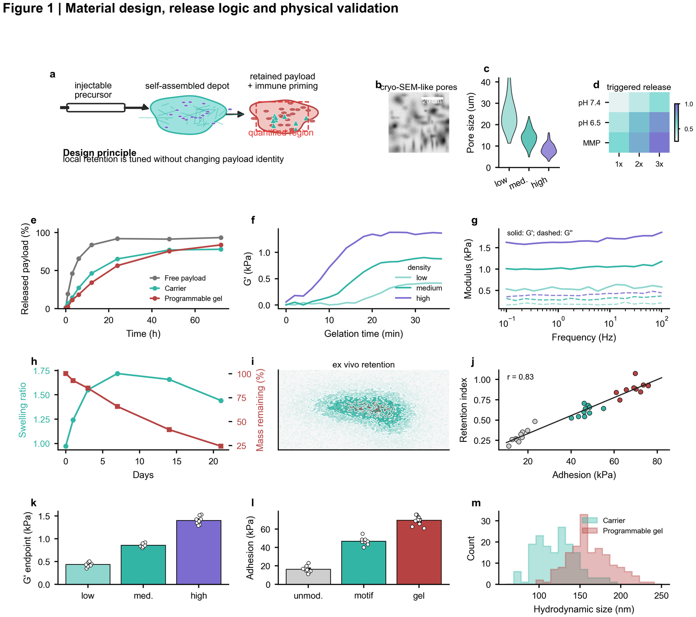
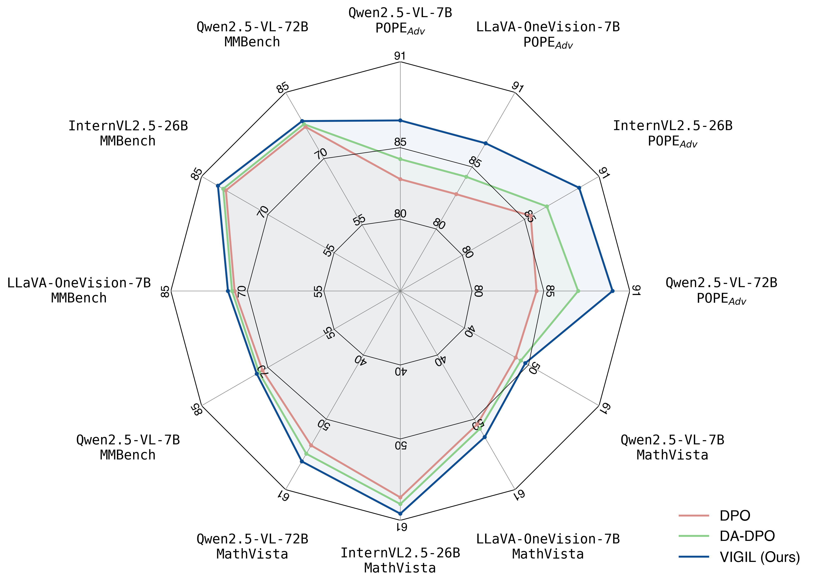

# `nature-figure` Skill

[中文说明](README.md)

`nature-figure` designs, generates, and audits submission-grade scientific figures for Nature-series papers, high-impact journals, manuscript panels, mechanism schematics, and graphical-abstract drafts.

## What To Use It For

- Generate Python / R plotting scripts and editable figures from data, legends, or manuscript claims.
- Redraw existing figures into clearer multi-panel manuscript figures.
- Plan multi-panel evidence chains around the default that one figure answers one Results-level scientific question, with panels serving different inferential roles such as primary evidence, control, orthogonal validation, perturbation, mechanism, or boundary rather than merely redrawing the same result under new metrics.
- Plan Figure 1, mechanism diagrams, workflows, graphical abstracts, or supplementary figures.
- Check panel labels, color hierarchy, panel-by-panel uncertainty, actual PDF glyph sizes, statistical annotations, source data, and export formats; at render time, automatically enforce a 1.5 pt tolerance for comparable row/column axes rectangles, dimensions, panel-label anchors, and repeated gutters, then detect text-text, text-stroke/curve, page-clipping, and suspicious fill/image-edge overlaps after every generation or layout revision.
- Separate flagship `Nature` initial, final main-figure, and Extended Data file contracts, including the under-250-word legend limit.
- Apply `Nature Machine Intelligence` (NMI)'s separate six-main-display, up-to-ten Extended Data, initial/final, 300-dpi/180-mm, and source-data requirements; the current pages give no standalone legend number, so retain the official 2018 `<300`-English-word rule only as a historical advisory, count the whole legend rather than each panel, and aim for 150–250 words.
- When explicitly requested, call `openai/gpt-image-2` through the OpenRouter Images API to draft AI concept schematics.
- For AI-assisted graphical abstracts, define one central message, figure type, audience, and evidence boundary before comparing compositions and accessible palettes; then separately verify the target journal's current AI policy, scientific accuracy, copyright, disclosure, and provenance. Treat the *Nature Careers* column as practitioner advice, not submission permission.

## Workflow

Start with a figure contract rather than a template:

- Core conclusion: what the figure must demonstrate.
- Evidence hierarchy: which panels are primary evidence and which are explanatory.
- Multi-panel architecture: write the figure-level claim first, then assign every panel a distinct evidence role and decide whether displaced material belongs in another figure or Extended Data/SI.
- Figure prototype: scatter, box plot, heatmap, mechanism diagram, workflow, multi-panel composition, and so on.
- Backend choice: Python or R; the first choice can be reused as the default preference.
- Data integrity: preserve all observations and requested variables by default, and record every exclusion rule with before/after counts.
- Template compatibility: compare scientific meaning, data shape, and transform constraints before exact reuse, structural adaptation, or style-only inheritance.
- Submission constraints: size, typography, color, resolution, vector format, and source-data traceability.
- Panel-alignment gate: Python axes or R patchwork/gtable measures real panel rectangles at final dimensions; horizontal rows of three or four equal-span panels must be equal width, regular grids and unequal-span `left two/right one` or mirrored layouts are inferred automatically, reliable misalignment blocks export, and free-positioned hero panels, insets, or colorbars require reasoned exemptions.
- Rendered collision gate: regenerate a collision JSON after every final-PDF render; reliable collisions must be fixed and ambiguous overlays reviewed individually.

## Typical Requests

- "Make a Nature-style multi-panel figure from this dataset, preferably in Python."
- "Use the figures4papers Nature Machine Intelligence layout as a reference and add a method-comparison figure."
- "Redraw this mechanism schematic, export SVG/PDF, and give me the source-data table."
- "Use OpenRouter to draft a graphical abstract, but do not treat it as a quantitative data figure."

## Example Preview

| Direction | Preview | Reusable Pattern |
|-----------|---------|------------------|
| Multi-panel manuscript figure | <a href="assets/gallery/fig1-material-mechanism-rich.png"></a> | Mechanism schematic, image panels, quantitative results, and correlation in one evidence chain |
| Chart-type atlas | <a href="assets/chart-atlas/atlas-03-heatmaps.png"></a> | Heatmaps, annotation matrices, cluster blocks, and diverging color scales |
| Third-party figures4papers reference | <a href="assets/figures4papers/figure_VIGIL/figures/comparison_radar.png"></a> | Study layout, legend, and multi-metric comparison grammar only; read the separate copyright notice before use |

## What You Need To Provide

- Raw data, existing figure, legend, manuscript claim, or intended mechanism.
- Target journal, single-column / double-column size, output format, and whether source data is required.
- Python / R preference; if absent, the skill asks or reuses the local preference.

## Outputs

- Runnable Python or R plotting script.
- SVG/PDF/TIFF/PNG figure files, with editable vector output preferred.
- Panel notes, source-data mapping, exclusion counts, a panel-by-panel visual audit, alignment JSON/diagnostic SVG, collision JSON/diagnostic PDF, and a pre-submission QA record.
- For AI-schematic tasks, a concept draft and a list of elements that need human redrawing or verification.

## Built-In References

- `references/api.md`: Python palette, style, and plotting-helper conventions.
- `references/asset-adaptation.md`: semantic matching, field mapping, and data-integrity rules for templates.
- `references/multipanel-evidence-architecture.md`: planning and audit from Results-level question to panel evidence roles, within-figure closure, cross-figure claim escalation, and main-figure/Extended-Data/SI placement.
- `references/template-catalog.md`: validated Python CSV templates for volcano, ROC, marker dot plot, marginal, and paired figures.
- `references/chart-types.md`: chart selection and visual rules.
- `references/demos.md`: third-party `figures4papers` index, use boundaries, and original adaptation patterns.
- `references/qa-contract.md`: export QA, source-data constraints, and static-preflight entry points.
- `references/ai-graphical-abstract-workflow.md`: message brief, composition and color, journal-policy gate, human scientific verification, disclosure, and provenance for AI-assisted graphical abstracts.
- `references/openrouter-image-generation.md`: provider-specific OpenRouter / GPT Image 2 generation and QA.
- `scripts/validate_figure.py`: reproducible static QA for Python and R plotting source.
- `scripts/audit_pdf_text.py`: scan exported PDF `Tf` operators for real glyph runs below the 5 pt floor, including reduced mathtext scripts.
- `scripts/audit_panel_alignment.py` and `scripts/panel_alignment.R`: measure final-size Matplotlib axes or R patchwork/gtable geometry and block unequal widths in three/four-panel rows, row/column edges, shared outer edges of spanning panels, panel labels, or repeated-gutter misalignment.
- `scripts/audit_figure_collisions.py`: automatic geometry audit for final Python/R PDFs, with blocking FAIL findings, review-required WARN findings, JSON output, and an optional marked diagnostic PDF.
- `scripts/figure_safety.py`: strict monotone interpolation and data/uncertainty-driven label positioning helpers.
- `assets/figures4papers/`: retained third-party scripts and previews; the repository MIT License does not automatically apply, so read `THIRD_PARTY_NOTICES.md` before use.

## Boundaries

- AI-generated images are not treated as real experimental results or quantitative data panels.
- An internally useful AI draft is not automatically described as a submission-ready final asset; assess those two states separately.
- The skill does not invent statistical tests, sample sizes, error-bar meanings, or experiment conditions.
- The skill does not silently sample for rendering convenience, ignore requested variables, or remove incomplete observations.
- Passing automated checks is not treated as visual acceptance; the alignment gate only proves declared geometric relationships are within tolerance, and uncertainty, label collisions, spacing, and salience still require panel-by-panel inspection.
- Private templates can be used locally, but user-facing outputs should not expose private paths, filenames, or sources.
- Third-party reference materials remain subject to their source terms and `THIRD_PARTY_NOTICES.md`; this repository grants no additional rights to those files.

The automatic collision audit requires PyMuPDF:

```bash
python -m pip install -r skills/nature-figure/requirements.txt
```

## Related Skills

- `nature-statistics`: check statistical annotations, n definitions, and p-value wording.
- `nature-writing`: align figure conclusions with manuscript narrative.
- `nature-paper2ppt`: turn manuscript figures into presentation slides.

## Relationship With Other Skills

- If the core task is statistical interpretation, sample-size definition, or significance wording, let `nature-statistics` audit the text before returning to `nature-figure`.
- If the figure is finished but the user needs the claim written into an abstract, introduction, or results section, hand off to `nature-writing`.
- If the figure should become a lab meeting deck or presentation slide, hand off to `nature-paper2ppt`.
- `nature-figure` is responsible for the figure itself; it does not replace statistical review or manuscript narration.
